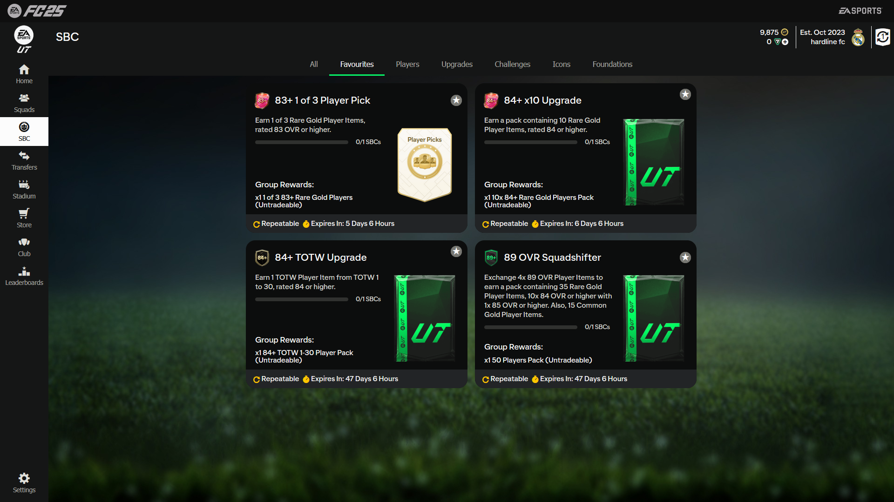

# FUT SBC Assistant

This is an automation script for SBCs (Squad Building Challenges) in FIFA Ultimate Team (FUT) using the AutoSBC extension.

---
## Current version: v1.2

Types of SBCs supported:
- Option 1: **83+ Player Pick** 
- Option 2: **84+ TOTW Upgrade** (added in v1.1)
- Option 3: **89 OVR Squadshifter** (added in v1.2)


- Optionally you can manually pass the `min OVR` and the `option`: 
  ```bash
  python main.py --option 3 --min-ovr 89
  ```

---
## Demo (v1.0.0)

Watch the demo video to see it in action:


[](https://youtu.be/c5DOvhQUPJs?si=Jsvoz76Zg0e-Fb1X)

---
## Requirements and presets

- Browser: Mozilla Firefox
- Zoom: 100%
- SBC Position: Left top corner (first row, first column)
- Extension: AutoSBC
- Start: SBC tab where the SBC is located


--- 
## Usage
1. Download the script:
- Click the "Code" button and select "Download ZIP".

2. Install the AutoSBC extension and enable it:
- Their website: [AutoSBC](https://autosbc.com/). Note: I'm not affiliated with the extension, but it is required for this script to work.

3. Extract the downloaded ZIP file.

4. Download Python programming language from [python.org](https://www.python.org/downloads/) and install it. Just click "Next" on all steps.

5. Organize the "Favorite SBCs" as follows:


   - The layout is **important** for the script to work correctly!

6. Open cmd and navigate to the extracted folder:
   ```bash
   cd path\to\extracted\folder
   ```
6. Run the script:
   ```bash
   python main.py
   ```

7. Enter:
    - **1** or press **Enter**: for 83+ Player Pick
    - **2**: for 84+ TOTW Upgrade


8. Alt+Tab to the FC companion browser window. And enjoy.

#### To interrupt the script: **move the mouse to the top left corner of the screen.**


---
## License

Armen-Jean Andreasyan © 2025